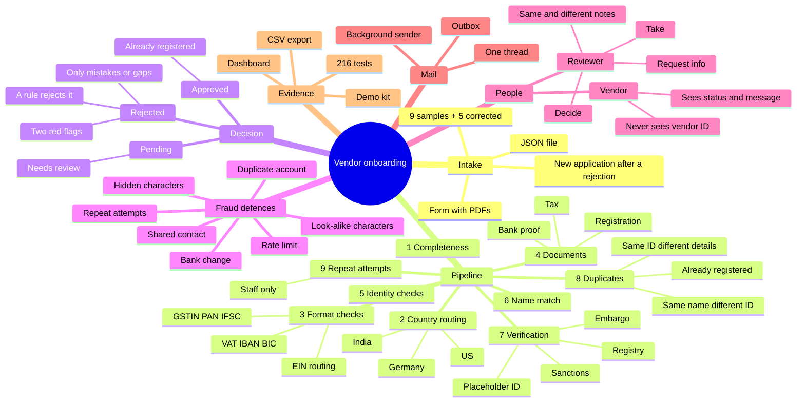

# Mind map

```mermaid
mindmap
  root((Vendor onboarding))
    Intake
      Form with PDFs
      JSON file
      9 samples + 5 corrected
      New application after a rejection
    Pipeline
      1 Completeness
      2 Country routing
        India
        US
        Germany
      3 Format checks
        GSTIN PAN IFSC
        EIN routing
        VAT IBAN BIC
      4 Documents
        Tax
        Registration
        Bank proof
      5 Identity checks
      6 Name match
      7 Verification
        Registry
        Sanctions
        Embargo
        Placeholder ID
      8 Duplicates
        Already registered
        Same ID different details
        Same name different ID
      9 Repeat attempts
        Staff only
    Decision
      Approved
        Already registered
      Pending
        Needs review
      Rejected
        A rule rejects it
        Two red flags
        Only mistakes or gaps
    Fraud defences
      Look-alike characters
      Hidden characters
      Bank change
      Shared contact
      Duplicate account
      Repeat attempts
      Rate limit
    People
      Vendor
        Sees status and message
        Never sees vendor ID
      Reviewer
        Take
        Decide
        Request info
        Same and different notes
    Mail
      Outbox
      Background sender
      One thread
    Evidence
      Dashboard
      CSV export
      216 tests
      Demo kit
```
