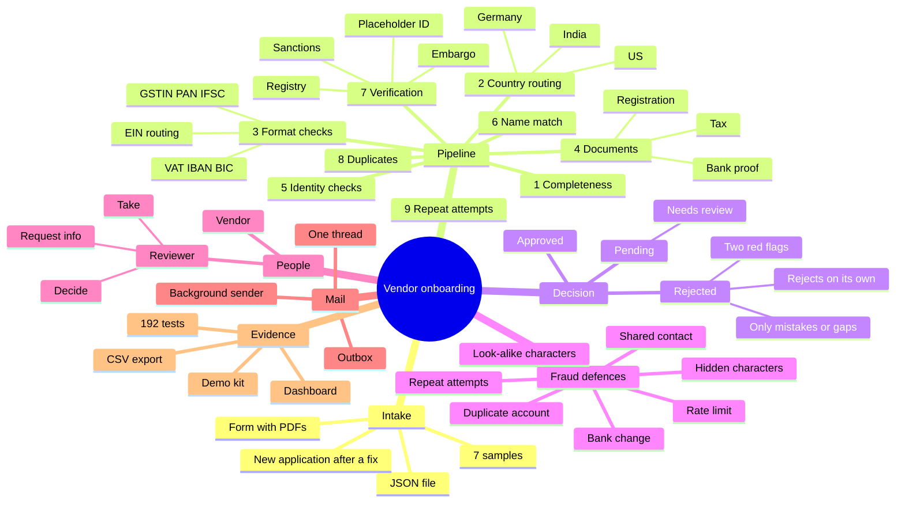

# Mind map

```mermaid
mindmap
  root((Vendor onboarding))
    Intake
      Form with PDFs
      JSON file
      7 samples
      New application after a fix
    Pipeline
      1 Completeness
      2 Country routing
        India
        US
        Germany
      3 Format checks
        GSTIN PAN IFSC
        EIN routing
        VAT IBAN BIC
      4 Documents
        Tax
        Registration
        Bank proof
      5 Identity checks
      6 Name match
      7 Verification
        Registry
        Sanctions
        Embargo
        Placeholder ID
      8 Duplicates
      9 Repeat attempts
    Decision
      Approved
      Pending
        Needs review
      Rejected
        Rejects on its own
        Two red flags
        Only mistakes or gaps
    Fraud defences
      Look-alike characters
      Hidden characters
      Bank change
      Shared contact
      Duplicate account
      Repeat attempts
      Rate limit
    People
      Vendor
      Reviewer
        Take
        Decide
        Request info
    Mail
      Outbox
      Background sender
      One thread
    Evidence
      Dashboard
      CSV export
      192 tests
      Demo kit
```
