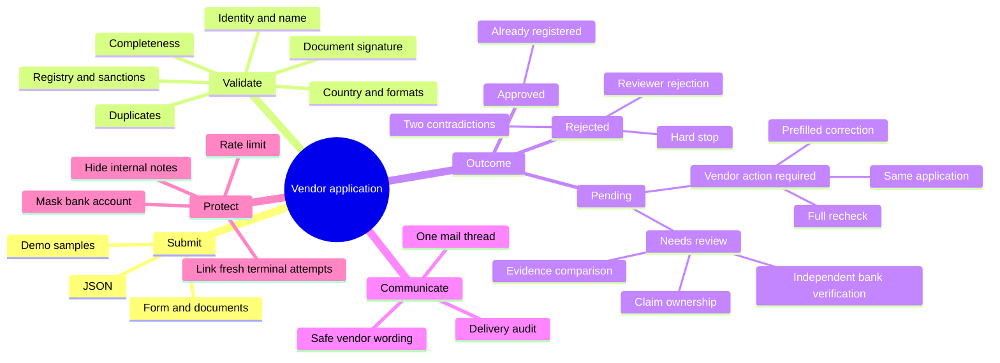

# Vendor onboarding mind map

```mermaid
mindmap
  root((Vendor application))
    Submit
      Form and documents
      JSON
      Demo samples
    Validate
      Completeness
      Country and formats
      Document signature
      Identity and name
      Registry and sanctions
      Duplicates
    Outcome
      Approved
        Already registered
      Pending
        Vendor action required
          Prefilled correction
          Same application
          Full recheck
        Needs review
          Claim ownership
          Evidence comparison
          Independent bank verification
      Rejected
        Hard stop
        Two contradictions
        Reviewer rejection
    Communicate
      Safe vendor wording
      One mail thread
      Delivery audit
    Protect
      Mask bank account
      Hide internal notes
      Link fresh terminal attempts
      Rate limit
```
